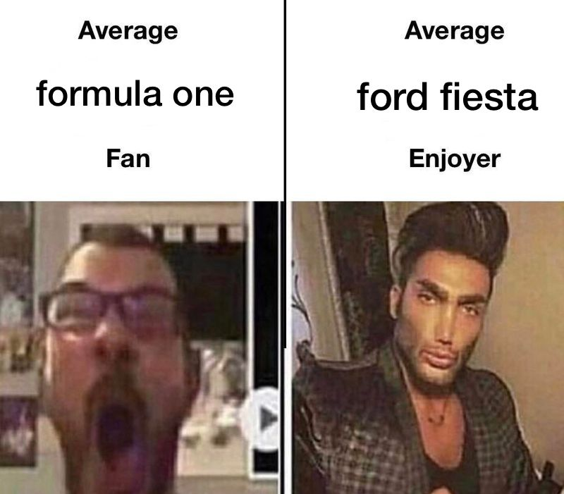
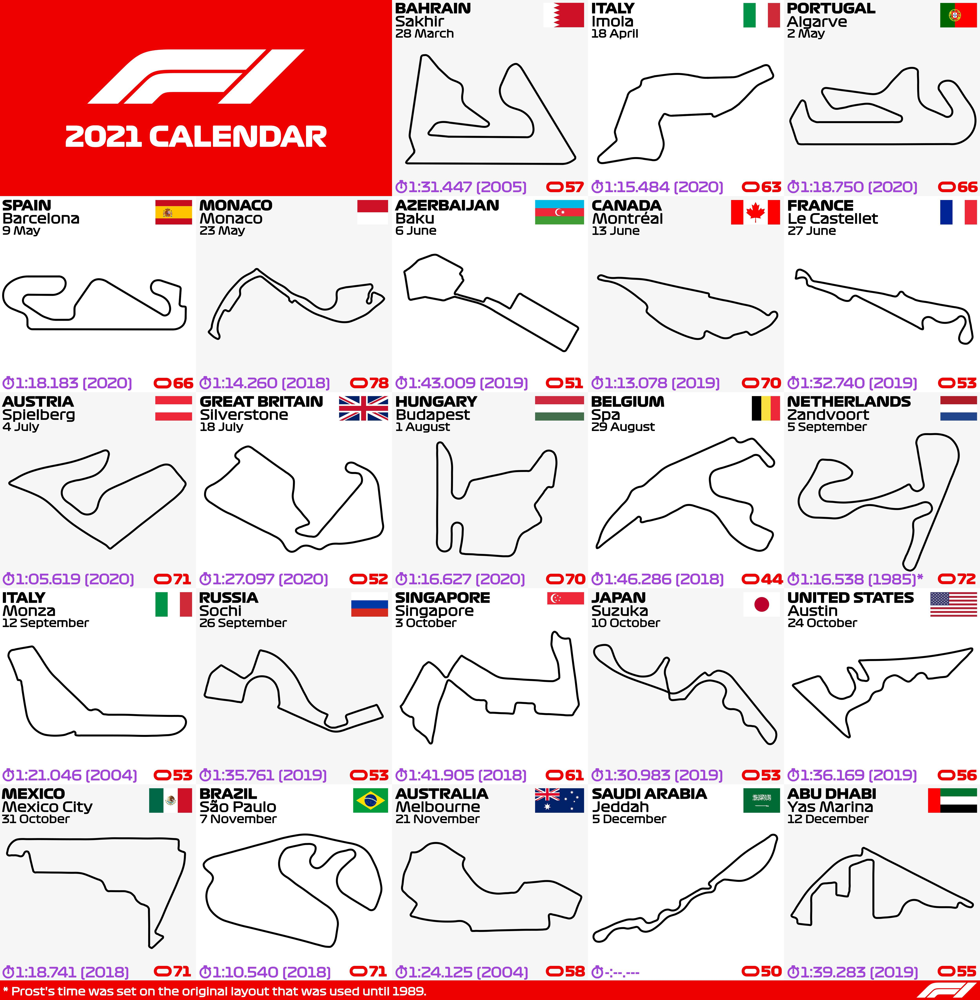
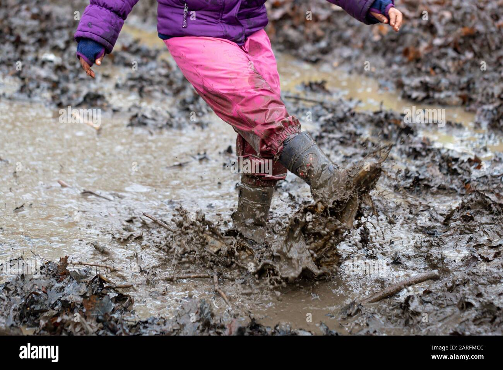
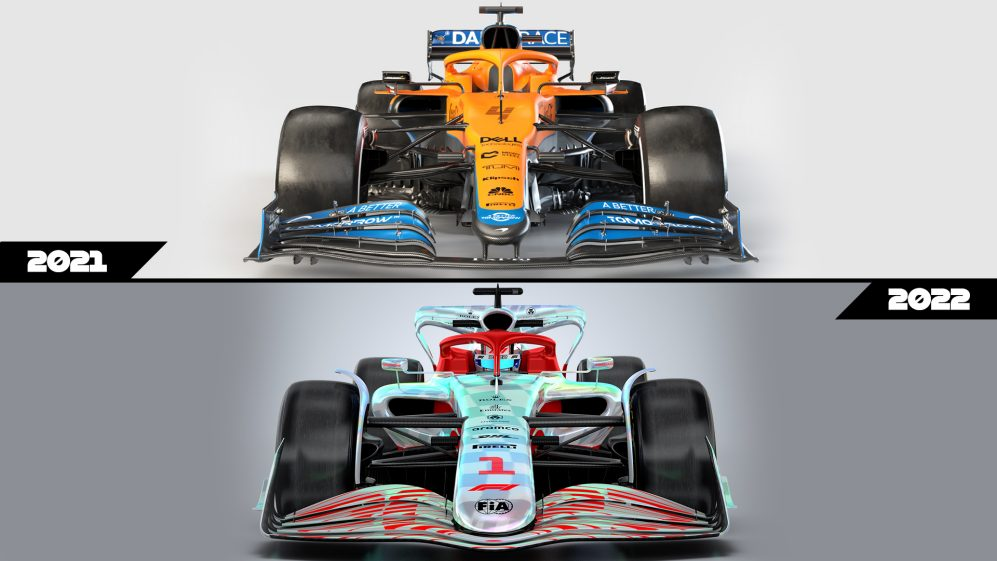
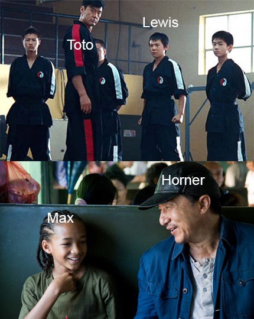
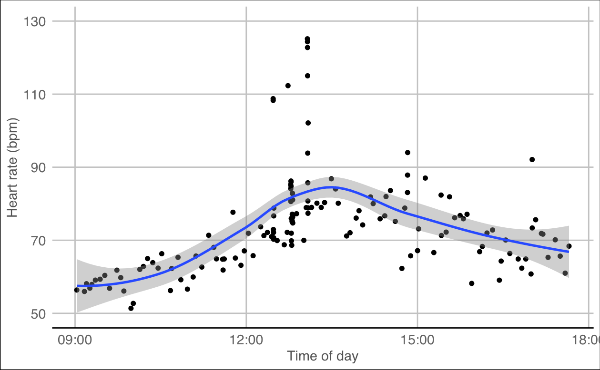
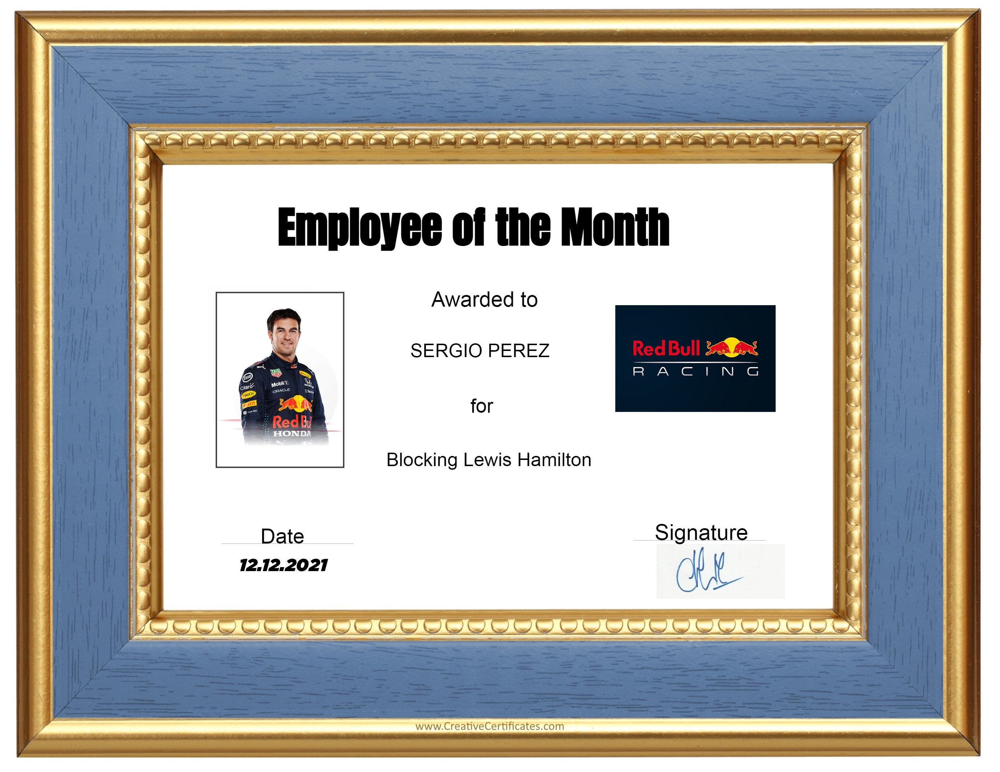
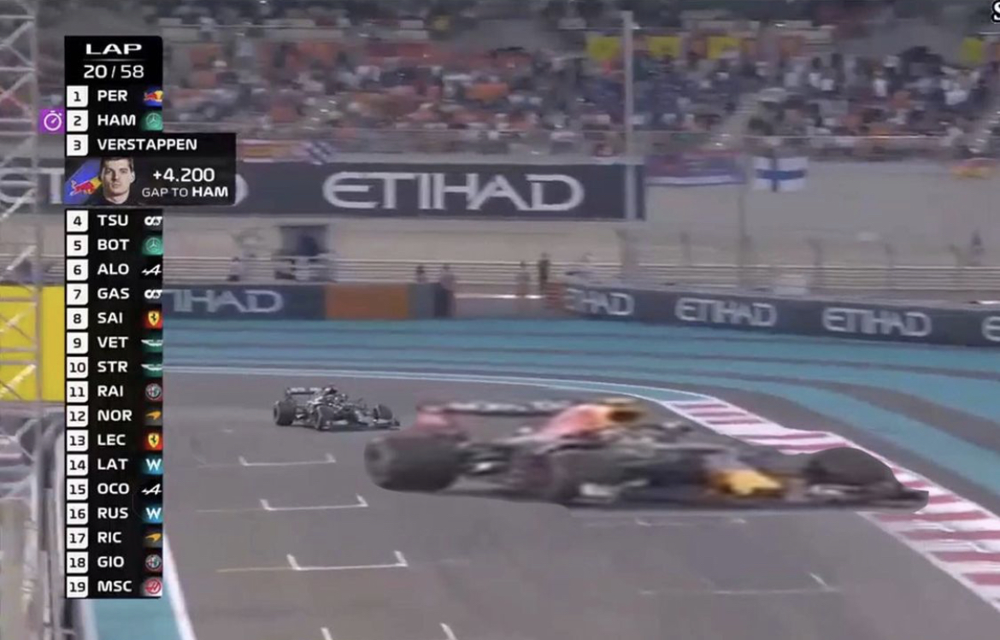
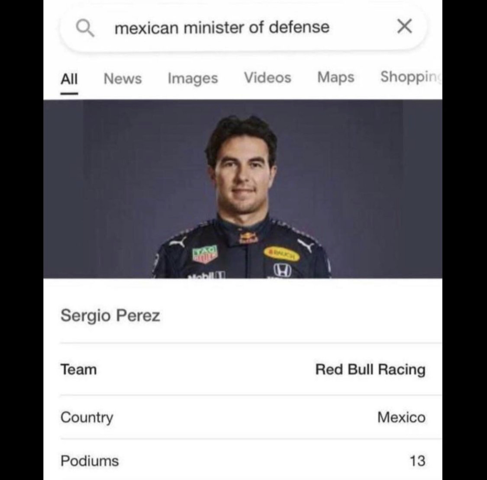
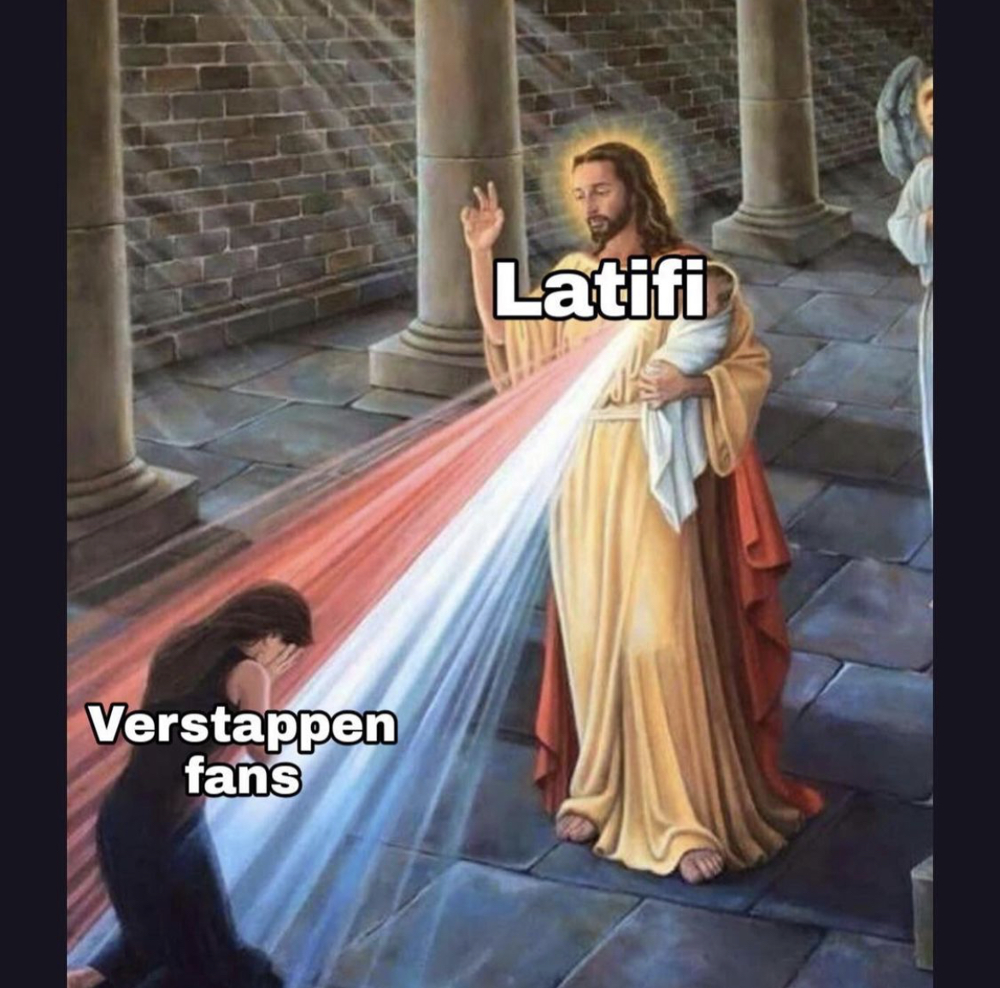

# wtf is this *chacho*
We are going to see:
- **How** do car go *brrrum*:
- **Why** do car go *brrrum*:
- **When** do car go *brrrum*:
- **Where** do car go *brrrum*:
- **What** do car go *brrrum*:


- **Why** I got to 125 bpm:
---
# *How* do car go brrrum:
Cars:
- 1.6 L *(puny, virgin)* V6 engine with *(big, chad)* turbo
- got like batteries and shit
- loads of aerodynamic stuff like wings and diffusors to stick the car to the floor *(glue was too bad)*

Teams:
- 20 cars (10 teams)
- not equal cars; same rules - different interpretations

Moni:
- $145 M spending limit *(or at least two gold foils)*

---


---
# *Why* do car go brrrum:

- World Driver's Championship *(aka what person can brrrum the fastest)*
- World Constructors's Championship *(aka what team can brrrum the fastest)*

points are:
- 1st - 25
- 2nd - 18
- 3rd - 15
- 4th - 12
- 5th - 10
- 6th - 8
- 7th - 6
- 8th - 4
- 9th - 2
- 10th - 1
- Fastest Lap - +1
- Anything else - fuck you
---
# *When* do car go brrrum:

done on weekends, so degenerates like me can see f1 on a sunday

### Friday 
- two practice sessions (60 min each)


### Saturday 
- one practice session 
- elimination qualifying (3 rounds)


### Sunday 
- bbbbbrrrum for 300km (*or one trip for tolete to get data*)
---
# *Where* do car go brrrum:

- 22-ish races in a season
- very lorg or very smol tracks
- very twisty or very spaghetti


---
# Capheaton
capheaton international circuit expected for 2022 season

---
# *What* do car go brrrum:

- FIA (*french* for federation internationale de l'automobile)
- basically give out penalties and stuff like that
- they probably touch k... karts
- some penalties given inconsistently as of recently
- new regulations next year - promoting overtaking

---
# max (dutch boi) vs. lewis (english boi)


---
# racerinno from yesterday
Setup:
- first time in 8 years that merc have been rivaled to the end of the season
- red bull *(yes a can of energy drink)* marginally better car
- merc caught up towards the end

Last race:
- EQUAL ON POINTS SINCE 1974
- max on pole, ham better pace 
- decided on the LAST LAP OF THE FUCKING RACE
---
```{r, eval=FALSE}
health_graph <- ggplot(health, aes(x=ts, y=rate)) + geom_jitter(colour="black", fill="white")+ xlab("Time of day") + ylab("Heart rate (bpm)") + theme_gdocs(base_size=12) + theme(axis.title = element_text(size = 12)) + geom_smooth(method=loess) + scale_y_continuous(limits = c(50,130), breaks = seq(50, 130, by = 20))

health_graph
```

---

---

---
## these memes are awful so here's this


---

---

---
# Bread👍🏼
