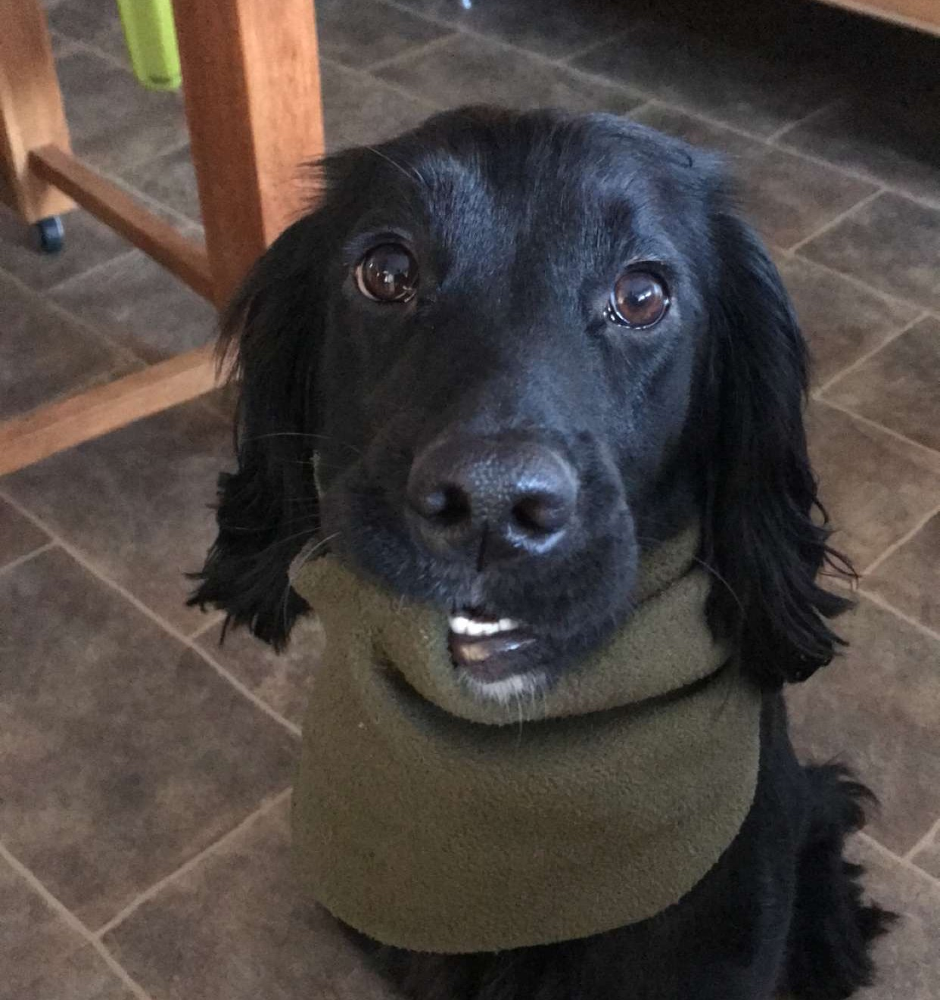
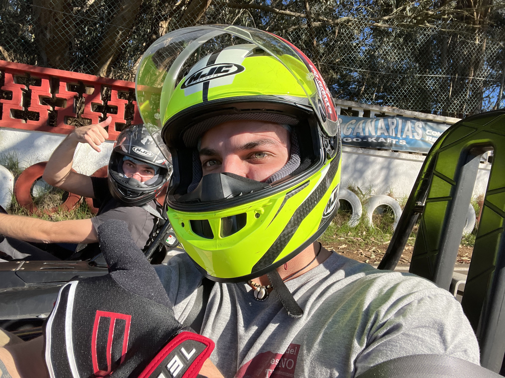
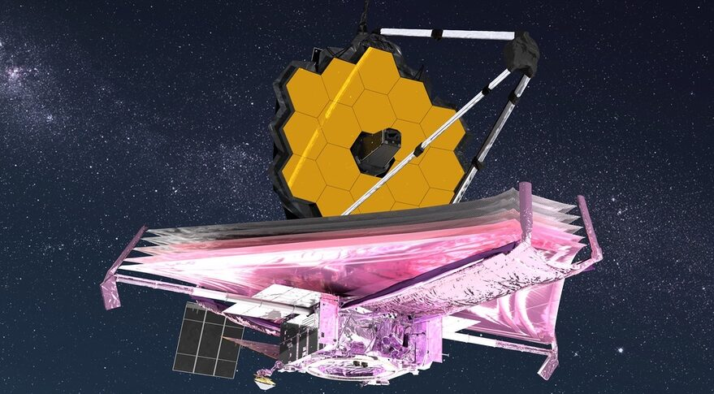
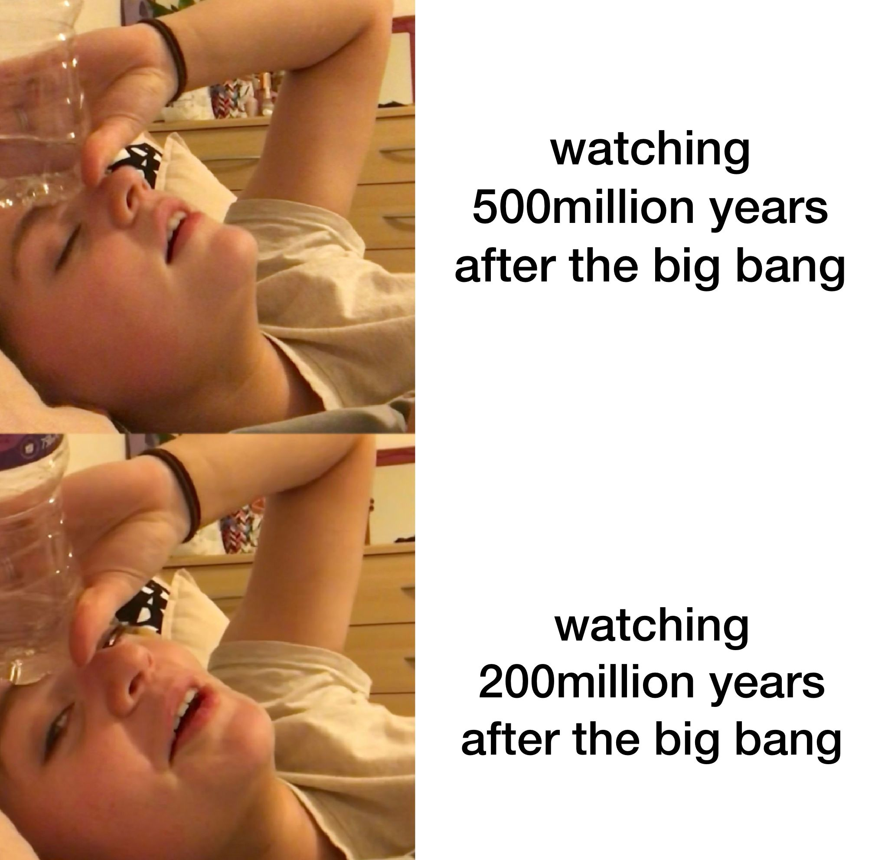

# wtf is this *chacho*
We are going to see:

- **Why** RStudio presentations are *superior*:
- **Why** my family have *disowned* me:
- **Why** I am wanted in seven countries for *tax evasion*:
- **What** is big camera in sky for:

---
# **Why** RStudio presentations are *superior*:

- You get to procrastinate from doing actual R 
- Actually fun to do and I get to include memes and pics of stinky
- You get a FREE eyebrow piercing
---

---
# **Why** my family have *disowned* me:

- I like doing *RStudio presentations*, is there anything else I need to say?
- Also I´m bald and have tattoos
- I am also a fucking AMAZING racist- I mean racer

---
# **Why** I am wanted in seven countries for *tax evasion*:

**FOR LEGAL REASONS THAT IS A JOKE**
---
# **What** is big camera in sky for:

- better than hubble telescope
- research - focused
- big boi triple lens
- cool pics basically of the formation of galaxies 200 million years after the BIG BEN I mean BIG BANG
- black holes (not like capheaton) and cool stuff like that
- also it is orbiting the L2 point in space - fucking cool

---
# Tracker

[trackerinno](https://www.jwst.nasa.gov/content/webbLaunch/whereIsWebb.html)
---

---
# Bread👍🏼

---
# The End

> So yeah... this is the end now...
  I am going to hang up now...

> Soooo yeah.... right... good bye- 
  yup... good bye... uhhh you don't want to say anyth...

>  good bye! yeah that is what we have been saying now...
good bye... 

> goodbyeloveyoubyeloveyoutoobygoodbye

